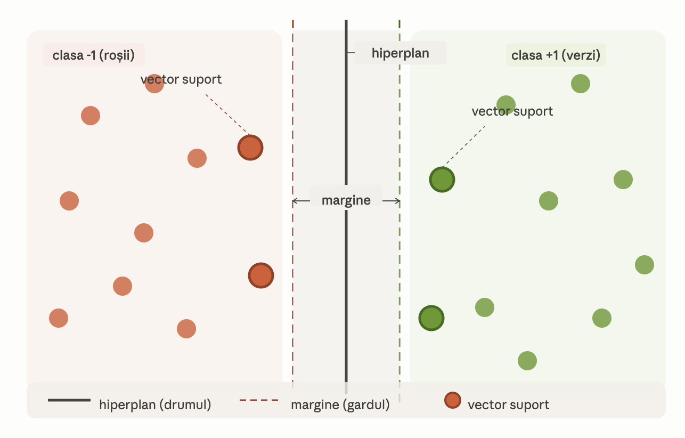

# Rezumat Curs 3 — EXEMPLU SIMPLU 

Iată diagrama! Câteva observații ca să legi vizualul de analogie:  
**Drumul** = linia neagră continuă din mijloc = hiperplanul  
**Gardul** = zona gri deschis dintre cele două linii punctate = marginea. SVM vrea acest gard cât mai lat  
**Scândurile de la capătul gardului** = cercurile cu contur mai gros (vectorii suport) — cele mai apropiate puncte din fiecare clasă de gard. Observă că dacă le muți, gardul se strâmtează sau se lărgește  
**Restul punctelor** = nu contează pentru poziția drumului, poți să le muți oriunde și gardul rămâne la fel  

