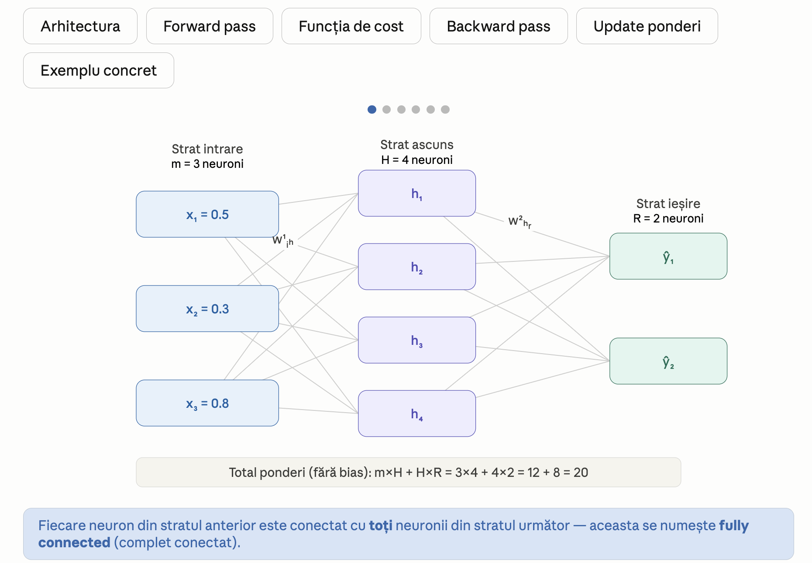
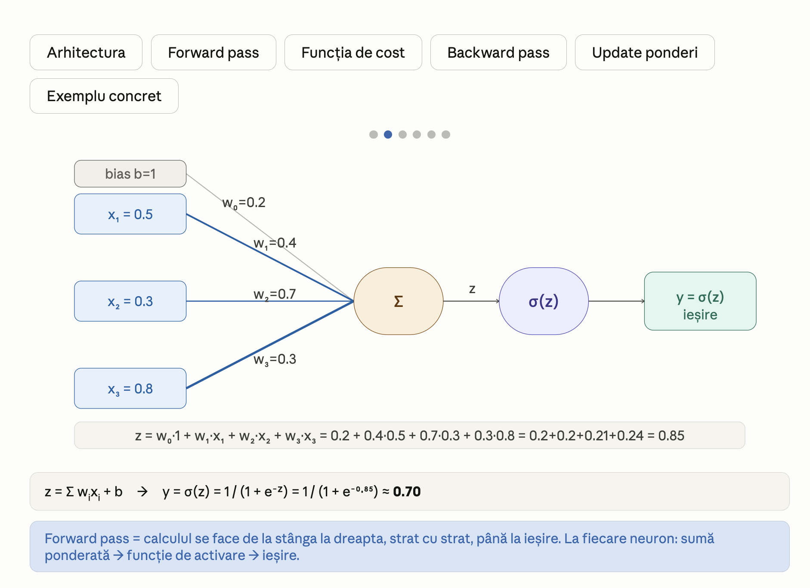
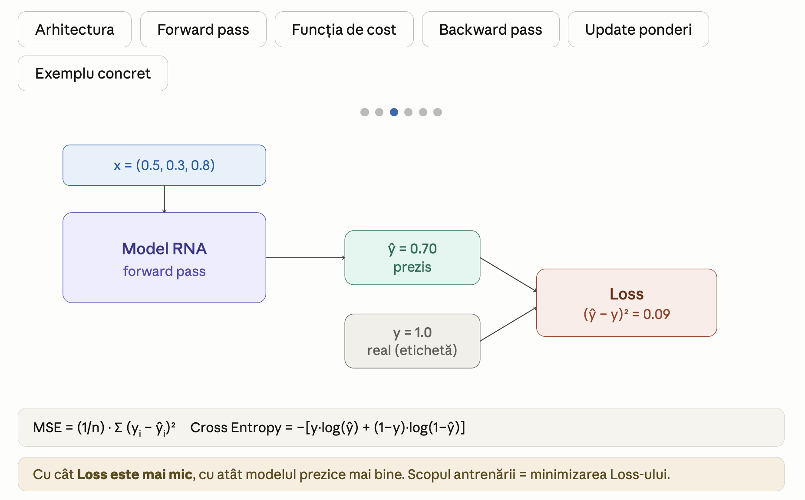
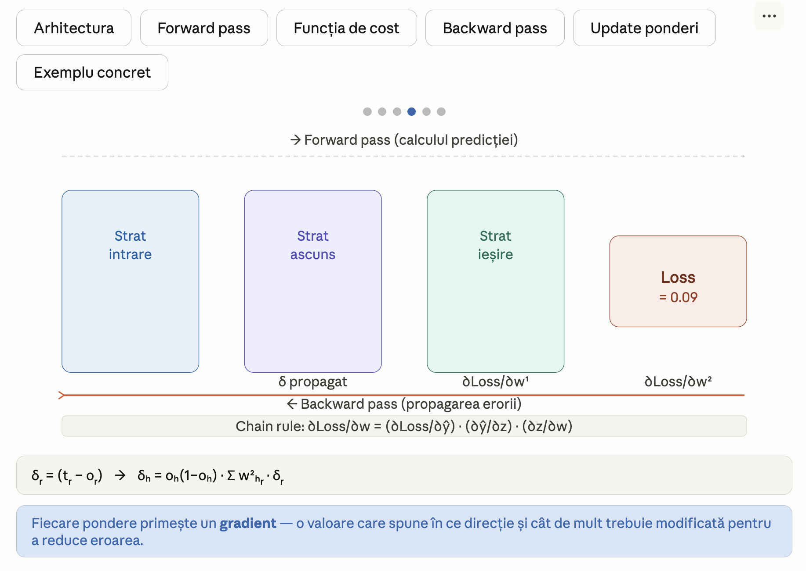
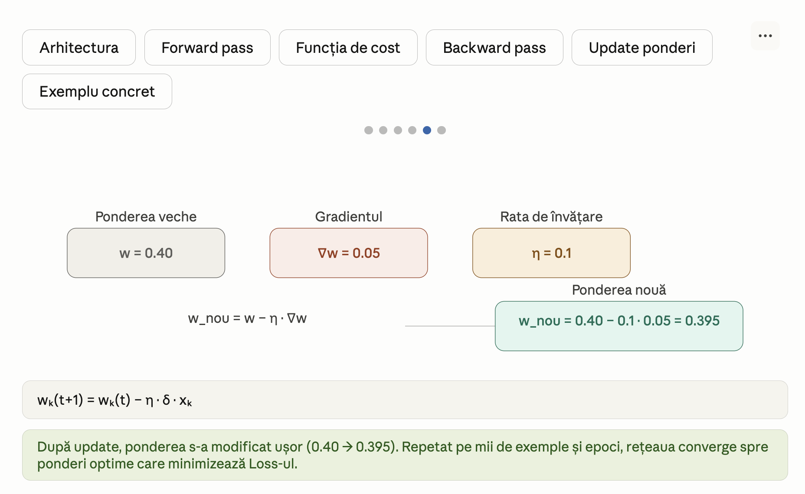
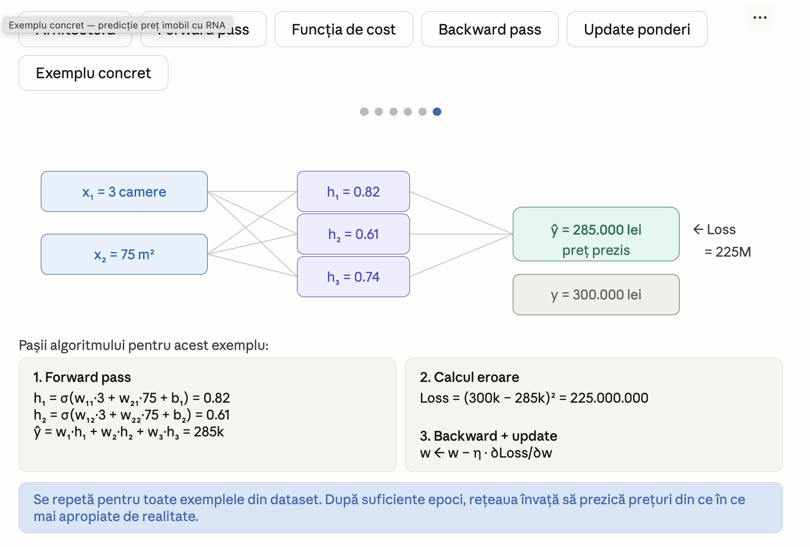

# EXEMPLE EASY ANN

Mai jos sunt prezentate structurile și diagramele pentru rețelele neuronale artificiale.

## Exemplul 1

## Exemplul 2

## Exemplul 3

## Exemplul 4

## Exemplul 5

## Exemplul 6
